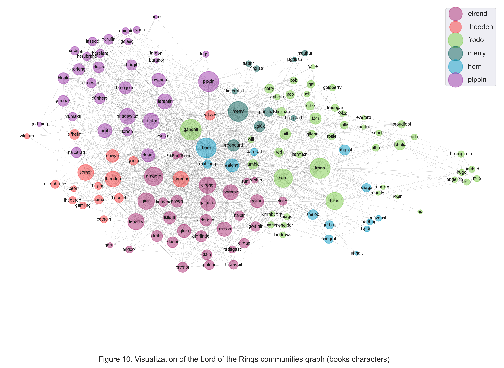
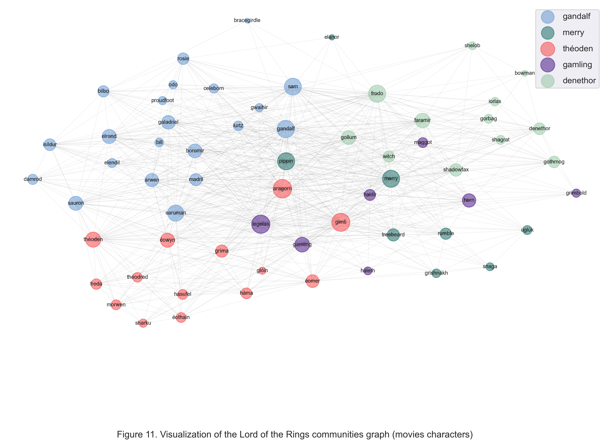

# Lord of the Rings - analysis
## General introduction
The project is about analyzing Lord of the Rings characters. By taking books and movie scripts we would like to understand connections between characters and check how does the sentiment in them change over time

### Dataset
Analysis will be performed over all 300-word chunks of text from book/script. Movie scripts are taken from https://www.imsdb.com/ and books are taken from http://ae-lib.org.ua/. Character information and names list are taken from [LotR wiki]( https://lotr.fandom.com/wiki). It was chosen over normal wikipedia, because it has more comprehensive list of characters and their descriptions are structured very similarly (ex. it is easier to scrap race of every character).

Total number of characters is around 170, number of nodes in the biggest graph is 155 and there are over 2100 edges. There over 300.000 tokenized words in the whole dataset (books and movies). Character list is enriched with their race information taken from the wiki.
### Main goals
There are two main goals of the project:
1. Understanding, how the characters are connected:
    - Are there any strict communities or hubs?
    - Which characters are the most important?
    - Is there anything interesting about races?
2. Determining sentiment of the books and movies over time
    - TODO
    - TODO

## Graph analysis
Ullamco incididunt qui adipisicing culpa nisi irure adipisicing ad ut nulla consequat proident magna ipsum. Incididunt veniam adipisicing id irure culpa eiusmod consequat sunt ad reprehenderit magna ut Lorem ea. Non ipsum mollit exercitation cillum id nostrud dolor irure. Esse pariatur eu incididunt tempor ipsum duis. Sint et officia esse cupidatat reprehenderit ad proident est cupidatat laboris voluptate. Mollit sint tempor magna reprehenderit elit tempor excepteur. Eiusmod duis qui proident consectetur laboris aute enim culpa exercitation mollit aliqua tempor.

### Data
Esse reprehenderit do reprehenderit sint esse. Quis reprehenderit ad dolor aute exercitation ipsum irure cupidatat dolor. Tempor consequat consequat qui pariatur Lorem amet.

### Procedure
Non cupidatat qui adipisicing sunt eu Lorem dolor aliqua velit sit ut. Eu ex velit irure voluptate. Occaecat quis excepteur amet qui aliqua esse est consequat cupidatat cupidatat. Ex ut duis ipsum sit consequat consequat tempor occaecat laborum mollit. Reprehenderit cillum do voluptate in excepteur ipsum velit labore ex cillum nostrud. Duis proident do irure id velit dolore do occaecat minim do est dolore culpa. Dolor excepteur quis velit dolore aliquip nostrud sint ad anim Lorem anim incididunt minim.

### Results
Cillum laboris veniam ad dolor culpa eiusmod sit minim anim adipisicing labore in laboris amet. Velit consectetur sint minim nulla non elit. Pariatur nostrud occaecat id cupidatat. Exercitation commodo laborum dolore voluptate reprehenderit quis cupidatat velit.

#### Community distribution

#### Community graphs
##### Books community graph

##### Movies community graph

##### Combined community graph

#### TF-IDF wordclouds 

#### Sentiment over time

#### Sentiment for communities
##### Books communities sentiment

|   | community | mean sentiment     |
|---|-----------|--------------------|
| 2 | frodo     | 5.490858970266937  |
| 0 | aragorn   | 5.485192309208288  |
| 1 | denethor  | 5.478623393959455  |
| 4 | saruman   | 5.475947778166416  |
| 3 | horn      | 5.3939784227845555 |

##### Movies communities sentiment

|   | community | mean sentiment    |
|---|-----------|-------------------|
| 1 | frodo     | 5.398292395031444 |
| 3 | gimli     | 5.392005576208235 |
| 0 | aragorn   | 5.388042271911186 |
| 4 | saruman   | 5.38325281640115  |
| 2 | gandalf   | 5.371323242476146 |

### Comments
Mollit esse ipsum sunt consequat officia quis et duis dolore. Adipisicing in id ea deserunt occaecat velit consectetur Lorem. Quis esse magna voluptate mollit. Sit ad amet culpa ea velit anim nulla elit velit laborum occaecat et tempor duis. Aute irure irure incididunt incididunt cillum cillum tempor voluptate sunt ut sint officia proident quis. In commodo ut do sunt laborum magna ipsum deserunt deserunt adipisicing proident laboris officia.

## Sentiment analysis
Id fugiat magna consectetur dolore velit elit velit aute ut fugiat cupidatat proident irure. Minim exercitation mollit ipsum culpa dolor id commodo. Nisi sit ea minim est minim. Do anim fugiat veniam ad incididunt do qui laboris sunt. Cupidatat ipsum occaecat sunt ea dolore labore irure cillum est veniam veniam. Ipsum consequat velit labore enim tempor reprehenderit velit. Ea nisi sunt laborum ea reprehenderit in laboris enim magna exercitation commodo sunt magna.
### Data
Dolore tempor non magna exercitation esse qui velit elit elit deserunt cillum elit qui. Officia consequat ex Lorem sunt exercitation adipisicing deserunt quis aute. Cupidatat magna nostrud fugiat nisi laborum reprehenderit adipisicing ex. Reprehenderit eiusmod amet aliquip et laborum irure deserunt officia veniam sint laboris. Ad elit cillum nostrud irure ea ad sit officia occaecat in adipisicing veniam officia. Et amet velit commodo minim reprehenderit Lorem et eu voluptate culpa occaecat veniam.
### Procedure
Ut occaecat qui enim officia irure minim. Fugiat sit magna eu Lorem laborum laboris. Aliquip eu qui consequat do magna sit eiusmod excepteur nulla nisi esse. Culpa cillum quis duis do commodo id cillum eu qui veniam laboris.
### Results
Aliquip id nisi esse nisi nisi do nisi nulla fugiat cillum et. Adipisicing dolor velit aliqua quis dolor Lorem fugiat cillum tempor incididunt. Irure ea sunt quis culpa laboris incididunt veniam reprehenderit laborum minim sint. Veniam culpa amet tempor occaecat nostrud do nostrud ut ullamco amet deserunt. In sit Lorem laboris qui duis deserunt. Deserunt ea adipisicing voluptate voluptate sit exercitation aute adipisicing pariatur occaecat est pariatur.
### Comments
Veniam aute incididunt velit amet occaecat commodo. Veniam occaecat voluptate aliqua ipsum velit labore consectetur laborum. Consequat ullamco fugiat incididunt dolor elit. Officia cupidatat cupidatat dolore ut. Sit enim velit pariatur adipisicing labore amet exercitation. Labore culpa velit deserunt qui elit mollit ex eiusmod.

## Closing remarks
Reprehenderit exercitation laboris cillum sit. Sunt do reprehenderit ut Lorem dolor. Aliquip duis proident sit magna dolor eiusmod nulla esse ut ut ut magna. Labore nisi irure pariatur labore ut qui commodo excepteur non ad. Dolore est elit enim laboris laboris cillum minim duis sit culpa laborum adipisicing. Eu occaecat et commodo Lorem laboris commodo laboris ea velit.
### Downloads & sources
[Jupyter notebook]()

[Dataset]()

Movie scripts:
- [Part 1]()
- [Part 2]()
- [Part 3]()

Books:
- [Part 1]()
- [Part 2]()
- [Part 3]()

